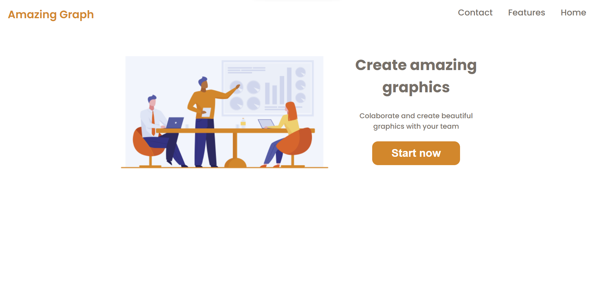

<!-- Título -->

<h1 align="center">Amazing Graph</h1>

<!-- Descrição -->

Criação de gráficos (Apenas visual).

<!-- Súmario -->

 <a href="#rodando-a-aplicação">Rodando A Aplicação</a> •
 <a href="#tecnologias">Tecnologias</a> •
 <a href="#autor">Autor</a>

<!-- Atualizações -->

### Features

- [ ] Menu display celulares/tablets

---

<!-- Site -->

<h2 align="center">Site</h2>

 <a href="https://amazinggraph-matheuspalmieri.netlify.app//">Site Do Projeto</a>

---

### Rodando A Aplicação

<a href="https://amazinggraph-matheuspalmieri.netlify.app//">Site Do Projeto</a>

---

### Tecnologias

As seguintes ferramentas foram usadas na construção do projeto:

- [HTML](https://html.com/)
- [CSS](https://html.com/css/)

---

### Autor

Create for <b>`Matheus Palmieri`</b>👨‍💻

 
 

🎉Projeto Amazing Graph Finalizado🚀

